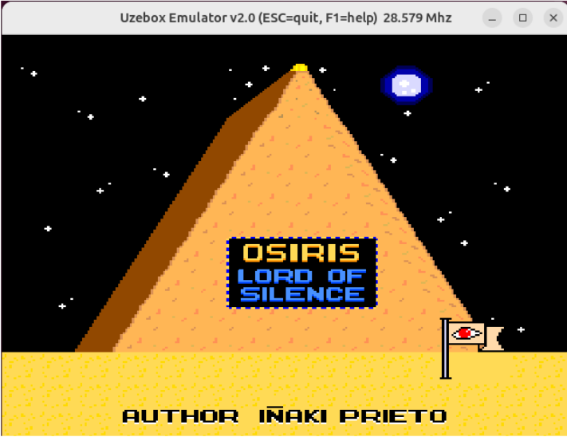
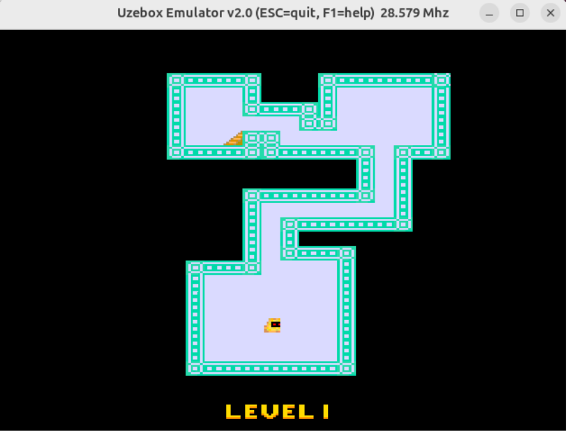

# OSIRIS - Lord of Silence

## Presentation

This Uzebox game has been created taking the retro game Tomb of the mask (https://en.wikipedia.org/wiki/Tomb_of_the_Mask) as a basis. It is a playable working demo,
with room for improvements (see To Do section)
  
## Gameplay

The gameplay is pretty simple. the main character (which moves fast and only stops against walls.. :-) ) needs to reach the maze exit, 
without falling into any traps...

## Author/s

The main author of the game is Iñaki Prieto ( https://github.com/unamordiditaoso ) a Compuer Science student at University of Deusto, Bilbao, Spain.
Active supervision of the project has been carried out by Alberto Tellaeche (altella in Uzebox forums), lecturer at the mentioned university.

## To do - Improvements

The current status of the game is of a working demo. It is playable in 10 levels, but some improvements are already identified to be implemented in a near future.
You can collaborate if you want !!
These are:
- Add a random generator for levels: Currently levels are hardcoded in flash, we would like to program a "level generator" capable of generating random mazes with increasing difficulty, with no end.
- Add music, or at least sounds (when you die, finish a level, etc)
- Add a "lives manager": For example, 3 lives, if you die and have more lives, you continue in the same level. If you lose all lives, start from the beginning.
- Add a time counter for completing the levels
- Add more variety of elements in mazes (moving enemies, extra lives,...)
- Points and elements to collect.
  
